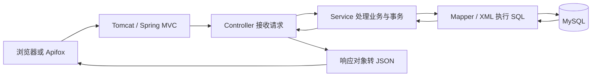

# 架构与数据库设计

状态：已按本设计实现后端。实际 DDL 见 [01_schema.sql](database/01_schema.sql)，交卷实现见 [ExamService.java](backend/src/main/java/com/feidian/exam/service/ExamService.java)。建表和集成测试已在独立测试库执行，未修改既有业务数据库。

## 请求链路与分层职责



登录拦截器在调用 Controller 前检查登录态、基础角色和必要的 CSRF 校验。Service 继续检查课程、答卷是否属于当前用户。不能因为已经通过登录检查，就允许用户访问任意 ID。

| 层或组件 | 职责 | 不应承担的职责 |
|---|---|---|
| Controller | 接收交卷 JSON，把当前登录学生和答案交给 Service | 编写大量 SQL、相信前端提交的分数 |
| Request DTO | 只描述允许用户提交的字段，例如答卷题目 ID 和所选项 | 混入标准答案、角色、服务端成绩 |
| Service | 检查是否本人答卷、是否已交卷，判分并完成事务 | 把身份校验交给按钮是否显示 |
| Mapper 接口 | 声明查答卷、更新明细、保存成绩等数据库操作 | 决定整个业务流程是否允许 |
| Mapper XML | 清楚写出 SQL、参数和结果映射 | 使用客户端字符串拼接 SQL |
| Entity / 数据对象 | 承接数据库字段，包括后端需要的正确答案快照 | 直接无差别返回前端 |
| Response DTO / VO | 只返回本接口允许展示的信息 | 泄露密码哈希、学生不可见的标准答案 |
| Spring | 创建和组织这些对象，注入其依赖 | 自动推断业务规则是否正确 |
| Spring Boot | 帮助启动、按依赖进行自动配置、管理属性 | 代替 Spring MVC 或 MyBatis |

## 代码目录

以下是已生成代码的主要目录，完整文件以项目实际内容为准。

```text
backend/
  pom.xml
  src/main/java/com/feidian/exam/
    ExamApplication.java
    controller/        AuthController、ProfileController、TeacherController、ExamController
    service/           AuthService、ProfileService、QuestionService、ExamService、GradeService
    mapper/            UserMapper、CourseMapper、QuestionMapper、ExamMapper、GradeMapper
    model/             数据库对象
    dto/request/       登录、资料、题目、交卷请求
    dto/response/      学生答卷、课程状态、成绩响应
    common/            ApiResponse、业务异常、全局异常处理
    config/            MVC 与登录相关配置
    security/          会话、登录、基础角色及 CSRF 校验
  src/main/resources/
    application.yml
    mapper/*.xml
  src/test/java/        判分测试、核心接口与事务集成测试
database/              手动初始化与演示数据
api/                   OpenAPI 文件、接口案例、联调记录
```

使用一个 Maven 后端模块。初版用显式构造器注入、清楚的字段/访问方法、可读的 SQL。Service 在确有多个实现时再抽接口，不为每个类机械增加一层。Java 代码遵循 JDK 8 语法。

## 六张表

精确字段长度、默认值、外键和检查约束以 DDL 为准。所有业务表使用 InnoDB；考试时间由服务端生成，统一使用北京时间展示。

| 表 | 关键字段 | 用途与约束 |
|---|---|---|
| sys_user | id BIGINT、username VARCHAR、password_hash VARCHAR、role VARCHAR、real_name、gender、phone、identity_no、college | 教师和学生共用；username 唯一；identity_no 对应工号/学号，按 role + identity_no 唯一；role 仅 TEACHER / STUDENT |
| course | id、name、teacher_id、description | 一门课程对应一名教师；teacher_id 关联 sys_user，服务端保证其角色为教师 |
| enrollment | id、student_id、course_id | 表示选课，UNIQUE(student_id, course_id)；也是同一学生同一课程开考时的锁定对象 |
| question | id、course_id、stem、option_a/b/c/d、correct_option、points、deleted、created_at、updated_at | 当前题库；单选 A–D；分值为正整数；删除使用 deleted 标志 |
| exam_attempt | id、student_id、course_id、attempt_no、status、score、total_score、started_at、submitted_at | 一次考试一条记录；状态 IN_PROGRESS / SUBMITTED；UNIQUE(student_id, course_id, attempt_no) |
| exam_attempt_item | id、attempt_id、source_question_id、position_no、stem_snapshot、option_a/b/c/d_snapshot、correct_option_snapshot、points_snapshot、chosen_option、earned_points | 一道本次试卷题一条记录；保存开考时题目与答案；交卷后记录学生答案及得分；UNIQUE(attempt_id, position_no) 与 UNIQUE(attempt_id, source_question_id) |

关系：教师 1:N 课程；学生通过 enrollment 与课程形成 N:M；课程 1:N 当前题目；学生与课程组合 1:N 答卷；答卷 1:N 快照明细。

`score` 在进行中为 null，交卷后为整数；`total_score` 为开考时各题分值之和。初始演示卷可以设置 10 题、每题 10 分，但接口同时返回得分和总分，不把任意卷的满分假设成 100。

学生答案存入快照明细行：一次答卷的一个题目只有一个最终答案。若后续需要逐次保存答题轨迹，再增加独立记录。

题目采用逻辑删除：教师从当前题库删除题目时，历史来源关联仍存在；历史判分和展示读取自己的快照，不依赖当前题库。

## 建议索引与查询

| 查询 | 索引建议 | 说明 |
|---|---|---|
| 按用户名登录 | sys_user(username) 唯一索引 | 找到用户后用密码哈希算法校验 |
| 教师课程列表 | course(teacher_id) | 先限制自己的课程 |
| 课程有效题目 | question(course_id, deleted, id) | 按固定顺序读取 |
| 学生已选课程 | enrollment(student_id, course_id) 唯一索引 | 也避免重复选课 |
| 学生历次考试 | exam_attempt(student_id, course_id, attempt_no) 唯一索引 | 倒序查看历史及生成下一次序号 |
| 教师课程成绩 | exam_attempt(course_id, status, submitted_at, id) | 分页筛选已交卷记录；最终用 EXPLAIN 核对 |
| 答卷题目顺序 | exam_attempt_item(attempt_id, position_no) 唯一索引 | 同一试卷内稳定排序 |

索引设计围绕实际 SQL；本次验证业务正确性，尚未完成大数据量性能测试及 EXPLAIN 基准。分页 page 为 1–100000，pageSize 默认 10、最大 50，计算 offset 后使用绑定参数。排序字段只允许后端定义的选项。

## 开考与题目快照

1. 从 Session 获取学生 ID，验证学生身份、选课关系。
2. 进入事务，锁定该学生该课程的 enrollment 行。
3. 检查当前答卷：若已有进行中答卷，返回其 ID；连续点击或并发点击不会新建多张。
4. 没有进行中答卷时，检查 mode。已有历史却使用 FIRST，返回 RETAKE_REQUIRED；没有历史却使用 RETAKE，返回 NO_PREVIOUS_ATTEMPT。
5. 读取课程当前有效题目。空题库返回 NO_QUESTIONS，不创建空卷。
6. 新建 exam_attempt，序号为上一次序号 + 1；把题干、选项、正确答案和分值复制到 exam_attempt_item。
7. 保存卷面总分并提交事务，只向学生返回不含正确答案的答卷响应。

锁同一个选课行的原因：两个“开始考试”请求即使来自不同线程，也必须依次完成检查和创建。开考事务明确使用 READ_COMMITTED，避免先前查询建立的旧快照导致等待锁后仍看不到前一事务的新答卷。唯一约束作为额外的数据库约束，不能替代完整事务规则。

快照示例：学生开始时题目的答案是 A、分值是 10；教师随后改成 B、20 分。该学生正在进行的答卷仍以 A、10 分为准；下一次新开的答卷才采用新题目。

## 交卷事务与幂等

1. 从 Session 取得学生身份，不从请求体接收 studentId 或 score。
2. 在 Service 的事务方法中按答卷 ID 和学生 ID 锁定答卷行。
3. 找不到本人答卷则返回 404；若已 SUBMITTED，返回原来保存的结果，不重新计分。
4. 校验答案：没有重复的答卷明细 ID；全部属于此卷；选项为 A–D；缺少某题答案按零分处理。非法输入直接失败。
5. 从 exam_attempt_item 读取标准答案快照及分值，对照选项累计得分。
6. 写入每题 chosen_option、earned_points。
7. 更新总得分、状态为 SUBMITTED、提交时间。
8. 事务成功提交后返回成绩；中间失败时所有写入一起回滚。

MyBatis 锁定本人答卷的查询示例：

```sql
SELECT id, status, total_score
FROM exam_attempt
WHERE id = #{attemptId} AND student_id = #{studentId}
FOR UPDATE;
```

`FOR UPDATE` 必须在事务内使用。第一个交卷请求持有该行锁时，第二个请求等待；第一个提交后，第二个读到 SUBMITTED，返回已有结果。这叫对重复交卷产生稳定结果，不能只靠前端禁用按钮实现。

`@Transactional` 放在由 Spring 管理的 Service 的 public 方法上，通过注入的 Service 从外部调用；注意同一个对象内部直接调用事务方法可能不经过代理。失败异常要让事务感知，不能吞掉异常后返回“成功”。明确配置回滚规则，并用测试证明中途故障会回滚。

## 判分算法

```text
总分 = 0
遍历此答卷的每一道快照题：
    找到学生提交给这道快照题的选项
    没答：本题得 0 分
    所选项等于快照正确答案：本题得快照分值
    其他情况：本题得 0 分
    累加本题得分
返回总分和逐题得分
```

用 Map 按答卷明细 ID 查找答案，并检查重复项和归属；所有 ID 都来自服务端生成的答卷。判分函数不访问数据库，单元测试覆盖全对、全错、漏答和非法输入。

## 登录和浏览器交互

使用 HttpSession 保存最少的用户 ID/角色信息，以 Cookie 携带会话标识。登录成功更新会话标识和 CSRF Token，退出使会话失效；密码使用 Boot 版本管理下的 spring-security-crypto 提供的 BCrypt 校验，不自行编写密码加密算法。

前端开发时优先统一通过本地代理请求 `/api`。若采用浏览器直连不同端口，需要明确允许的源、携带 Cookie 的配置，并验证 OPTIONS 预检；Apifox 成功不代表浏览器 Cookie 或跨域设置必然正确。

Cookie 登录方案需要配套服务端 CSRF Token 校验：读取 token 的接口供前端初始化使用，登录、退出及其他写入请求携带 `X-CSRF-Token`。不能把关闭浏览器检查当作联调方案。相关校验与失败案例随登录模块实现。

## 数据初始化与开发验证

开发与测试使用独立数据库，名称在初始化脚本中明确。数据库密码通过本地环境变量或未公开的本地配置提供。初始化脚本与演示数据手动执行，应用启动时不自动删表重建。

事务、约束、锁与 SQL 集成测试在单独的 MySQL 测试库中验证；纯 Java 判分测试不需要数据库。没有实际运行的项目测试不会记为通过。
